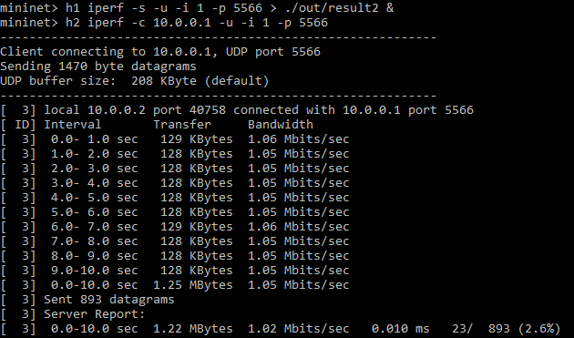

# Route Configuration

This repository is a lab for NCTU course "Introduction to Computer Networks 2018".

---
## Abstract

In this lab, we are going to write a Python program with Ryu SDN framework to build a simple software-defined network and compare the different between two forwarding rules.

---
## Objectives

1. Learn how to build a simple software-defined networking with Ryu SDN framework
2. Learn how to add forwarding rule into each OpenFlow switch

---
## Execution

### How to run the program?
Note: This guide assumes you already have all the required programs and libraries installed. If not, you may log in to the provided container with "ssh –p <LAST_5_DIGITS_OF_STUDENT_ID> root@140.113.195.69" and password "cn2018"(assuming that you are using Linux like me).

  * Clone the repository
  ```
git clone https://github.com/nctucn/lab3-<GITHUB_ID>.git Route_Configuration 
```
  * Start the service of Open vSwitch
  ```
  service openvswitch-switch start
  ```
  * Open another terminal
  (Log in to the container if you need to)
  * Run the desired topology in one terminal **first**
  In the directory ```~/Route_Configuration/src```
  ```
  mn --custom <DESIRED_TOPO>.py --topo topo --link tc --controller remote
```
  * Run the desired CONTROLLER in another terminal
  In the directory ```~/Route_Configuration/src```
  ```
  ryu-manager <DESIRED_CONTROLLER>.py --observe-links
``` 
  * Test the performance with the following iPerf commands in the mininet (first) terminal. Replace <RESULT> with the desired name of the report.
  ```
   mininet> h1 iperf -s -u -i 1 –p 5566 > ./out/<RESULT> &
   mininet> h2 iperf -c 10.0.0.1 -u –i 1 –p 5566
``` 
  * You may check and compare the results in the ```Route_Configuration/src/out```

### Notes
#### How to traverse across the directories in the (Linux) terminal
  * Use ```cd``` to change current working directory
  * Use ```ls``` to list all files in the current working directory
  * use ```cd ..``` to return to a higher level directory or use ```cd ~``` to go to the root directory
  * Use ```less``` or ```cat``` to read the contents of a file
  * Use ```vim``` or ```nano``` should you ever need to edit a file
  
#### How to run mininet?
  * Use ```mn``` to run mininet
  * Use ```exit``` to exit mininet
  * Use ```mn -c``` after exiting to do a clean up
  
#### What to do if mininet crashes?
  * Use ```mn -c``` to do a clean up

#### How to exit the controller program?
  * Use ~Ctrl+Z~ to leave the mininet CLI
  * Use ```mn -c``` after exiting to do a clean up

### What is the meaning of the executing command (both Mininet and Ryu controller)?
  * Mininet: ```mn --custom <DESIRED_TOPO>.py --topo topo --link tc --controller remote```
    * *mn*: Run mininet
    * *custom*: Use the custom mininet file provided (<DESIRED_TOPO>.py)
    * *topo*: Indicates the topology to be used. Points to the topology defined in <DESIRED_TOPO>.py in this case
    * *link*: Specifies the type of link to be used (TCLink in this case)
    * *controller*: Specifies controller to be used. In this case, we are using a remote controller, which is the custom controller that we will be running with Ryu in another terminal, hence it being remote
  * Ryu Controller: ```ryu-manager <DESIRED_CONTROLLER>.py --observe-links```
    * *ryu-manager*: Runs the ryu-manager with <DESIRED_CONTROLLER>.py as the controller
    * *observe-links*: This option will turn on the topology RYU app, which will print out the links in the mininet
    
### Show the screenshot of using iPerf command in Mininet (both `SimpleController.py` and `controller.py`)
* SimpleController.py   

   
* controller.py   

---
## Description

### Tasks
1. Environment Setup
  * Join the lab at https://classroom.github.com/a/RHNMq4Td
  * Login to the container using SSH
  ```
  $ ssh –p 45079 root@140.113.195.69
Password: cn2018
  ```
  * Clone the repository
  ```
  $ git clone https://github.com/nctucn/lab3-SamsonChoo.git Route_Configuration
  ```
  * Start the service of Open vSwitch
  ```
  $ [sudo] service openvswitch-switch start
  ```
  * Run mininet for testing
  ```
  $ [sudo] mn
  mininet> exit
  ```  
&nbsp;
2. Example of Ryu SDN
  * Open new terminal and log in to the container (instructions above)
  * Run SimpleTopo.py in one terminal at *Route_Configuration/src* (Refer to Notes above for how to traverse between directories)
  ```
  $ [sudo] mn --custom SimpleTopo.py --topo topo --link tc --controller remote
  ```
  * Run SimpleController.py in another terminal
  ```
  $ [sudo] ryu-manager SimpleController.py --observelinks
  ```
  * Leave the mininet CLI in the topo(first) terminal **first**, then exit in the controller(second) terminal with clean up. (Refer to Notes above for how to exit and clean up)
&nbsp;
3. Mininet Topology
  * Duplicate the example code SimpleTopo.py and name it topo.py (in src directory)
  ```
  $ cp SimpleTopo.py topo.py
  ```
  * Use ```vim topo.py``` to edit the topology file
  * Specify the link parameters of the 3 links between the 3 switches, at line 21~23
    * Identify each link represented by each line of self.addLink() from the first two parameters
    * add the bw (bandwidth), delay and loss parameters in self.addLink()
    * bw is given in Mbits as integer, delay is given as string, loss is given in percentage as integer
    * In command mode of vim, press "i" to enter insert mode and press "Esc" to go back to command mode
    * In command mode of vim, enter ":wq" and press Enter to save and quit the file
  * Test the new file. Repeat step 2 with topo.py instead of SimpleTopo.py
&nbsp;
4. Ryu Controller
  * Duplicate the example code SimpleController.py and name it controller.py (in src directory)
```
$ cp SimpleController.py controller.py
```
  * Use `vim controller.py` to modify the forwarding rules
    * Refer to SimpleTopo.py/topo.py to find out the src and destination port of each link
    * Modify the forwarding rules at function switch_features_handler(self, ev) at line 68
    * msg.datapath.id represents the switch to be configured
    * in_port specifies in the input port
    * parser.OFPActionOutput() specifies the output port
    * Edit the lines above to add the forwarding rules, stating the input port, output port, and switch used
    * Use "v" in command mode to make selection, "y" to copy, and "p" to paste after the cursor
    * Remember to modify the comments too to show the correct flow
    * Save and exit the file
&nbsp;
5. Measurement
  * Repeat step 2 with topo.py instead of SimpleTopo.py, but do not exit mininet yet
  * Use the following iPerf commands to measure the bandwidth in your network
  ```
  mininet> h1 iperf -s -u -i 1 –p 5566 > ./out/result1 &
  mininet> h2 iperf -c 10.0.0.1 -u –i 1 –p 5566
  ```
  * Leave topo.py then SimpleController.py, remember to clean up
  * Repeat step 2 with topo.py instead of SimpleTopo.py and controller.py instead of SimpleController.py, but do not exit mininet yet
  * Use the following iPerf commands to measure the bandwidth in your network
  ```
  mininet> h1 iperf -s -u -i 1 –p 5566 > ./out/result2 &
  mininet> h2 iperf -c 10.0.0.1 -u –i 1 –p 5566
  ```
  * Leave topo.py then SimpleController.py, remember to clean up
  * Compare the performances

### Discussion

> TODO:
> * Answer the following questions

1. Describe the difference between packet-in and packet-out in detail.
The Packet-in function transfers the received packets to the controller, while Packet-out transfers the packets forwarded by the controller from the specified port. The controller can use the Packet-In function to receive packets from the switch. The switch analyzes the received packets to learn the MAC address of the host and information about the connected port. After learning, the switch transfers the received packets. The switch investigates whether the destination MAC address of the packets belong to the learned host. Depending on the investigation results, the switch performs the following processing. If the host is already a learned host : Uses the Packet-Out function to transfer the packets from the connected port. If the host is unknown host : Use the Packet-Out function to perform flooding.
   
2. What is “table-miss” in SDN?
  Every flow table must support a table-miss flow entry to process table misses. The table-miss flow entry specifies how to process packets unmatched by other flow entries in the flow table (see 5.1), and may, for example, send packets to the controller, drop packets or direct packets to a subsequent table. It has a priority of 0 and a match of anything. It’s like a catch-all, and the actions to be taken depend on how you configure it. 


3. Why is "`(app_manager.RyuApp)`" adding after the declaration of class in `controller.py`?
  The declaration makes the class a Ryu Application. A Ryu application is a python module which defines a subclass of ryu.base.app_manager.RyuApp. The ryu.base.app_manager is the central management of Ryu applications. It loads Ryu applications, provides contexts to Ryu applications and route messages among Ryu applications. The ryu.base.app_manager.RyuApp is the base class for Ryu applications, and RyuApp subclasses are instantiated after ryu-manager loaded all requested Ryu application modules.
   
4. Explain the following code in `controller.py`.
    ```python
    @set_ev_cls(ofp_event.EventOFPPacketIn, MAIN_DISPATCHER)
    ```
    The line above is a python decarator, as indicated by the "@" sign. A Python decorator is a specific change to the Python syntax that allows us to more conveniently alter functions and methods. The decorator here is defined in https://github.com/osrg/ryu/blob/master/ryu/controller/handler.py. Basically, it associates that function (packet_in_handler) with an event class (ofp_event.EventOFPPacketIn), so that when Ryu receives an *EventOFPPacketIn*, it calls packet_in_handler. The second parameter *Dispatcher*, none by default, indicates the negotiation phase for which events should be generated for this handler. In this case, "MAIN_DISPATCHER" indicates that "Switch-features message received and sent set-config message".

5. What is the meaning of “datapath” in `controller.py`?
datapath comes from msg.datapath, which is a ryu.controller.controller.Datapath instance that describes an OpenFlow switch from which we received this OpenFlow message.

6. Why need to set "`ip_proto=17`" in the flow entry?
IP Protocol 17 means the next level protocol being used is UDP.
   
7. Compare the differences between the iPerf results of `SimpleController.py` and `controller.py` in detail.
The iPerf results Result1 and Result2 both showed similar glitter and bandwidth, as iPerf uses its own pre-defined bandwidth for testing instead of the user-defined bandwidth in the topology. However, Result2 clearly shows a lower loss rate(2.6%) than Result1(4%), a consistent observation from multiple trials.
   
8. Which forwarding rule is better? Why?
The second forwarding rule is better as it has a higher bandwidth and lower loss rate. This is because it utilised switch 2 which has higher performance links with s1 and s3. This shows that the path with the least hop is not necessarily the best path.

---
## References
* **Ryu SDN**
    * [Ryu topology discovery](https://sdn-lab.com/2014/12/31/topology-discovery-with-ryu/)
    * [Ryu API Documentation](https://ryu.readthedocs.io/en/latest/api_ref.html)
* **Mininet**
    * [Mininet Walkthrough](http://mininet.org/walkthrough/)
* **Others**
    * [Markdown Tutorial](https://guides.github.com/features/mastering-markdown/)
    * [Vim Cheatsheet](https://www.maketecheasier.com/vim-keyboard-shortcuts-cheatsheet/)
    * [OpenFlowSwitch Specification](https://www.opennetworking.org/wp-content/uploads/2014/10/openflow-spec-v1.4.0.pdf)
    * [Python Decorators](https://wiki.python.org/moin/PythonDecorators)
    * [Protocol Numbers](https://www.iana.org/assignments/protocol-numbers/protocol-numbers.xhtml)

---
## Contributors

* [Samson Choo](https://github.com/SamsonChoo)
* [David Lu](https://github.com/yungshenglu)

---
## License

GNU GENERAL PUBLIC LICENSE Version 3
