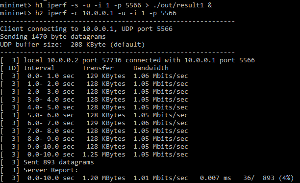

# Route Configuration

This repository is a lab for NCTU course "Introduction to Computer Networks 2018".

---
## Abstract

In this lab, we are going to write a Python program with Ryu SDN framework to build a simple software-defined network and compare the different between two forwarding rules.

---
## Objectives

1. Learn how to build a simple software-defined networking with Ryu SDN framework
2. Learn how to add forwarding rule into each OpenFlow switch

---
## Execution

### How to run the program?
Note: This guide assumes you already have all the required programs and libraries installed. If not, you may log in to the provided container with "ssh –p <LAST_5_DIGITS_OF_STUDENT_ID> root@140.113.195.69" and password "cn2018"(assuming that you are using Linux like me).

  * Clone the repository
  ```
git clone https://github.com/nctucn/lab3-<GITHUB_ID>.git Route_Configuration 
```
  * Start the service of Open vSwitch
  ```
  service openvswitch-switch start
  ```
  * Open another terminal
  (Log in to the container if you need to)
  * Run the desired topology in one terminal **first**
  In the directory ```~/Route_Configuration/src```
  ```
  mn --custom <DESIRED_TOPO>.py --topo topo --link tc --controller remote
```
  * Run the desired CONTROLLER in another terminal
  In the directory ```~/Route_Configuration/src```
  ```
  ryu-manager <DESIRED_CONTROLLER>.py --observe-links
``` 
  * Test the performance with the following iPerf commands in the mininet (first) terminal. Replace <RESULT> with the desired name of the report.
  ```
   mininet> h1 iperf -s -u -i 1 –p 5566 > ./out/<RESULT> &
   mininet> h2 iperf -c 10.0.0.1 -u –i 1 –p 5566
``` 
  * You may check and compare the results in the ```Route_Configuration/src/out```

### Notes
#### How to traverse across the directories in the (Linux) terminal
  * Use ```cd``` to change current working directory
  * Use ```ls``` to list all files in the current working directory
  * use ```cd ..``` to return to a higher level directory or use ```cd ~``` to go to the root directory
  * Use ```less``` or ```cat``` to read the contents of a file
  * Use ```vim``` or ```nano``` should you ever need to edit a file
  
#### How to run mininet?
  * Use ```mn``` to run mininet
  * Use ```exit``` to exit mininet
  * Use ```mn -c``` after exiting to do a clean up
  
#### What to do if mininet crashes?
  * Use ```mn -c``` to do a clean up

#### How to exit the controller program?
  * Use ~Ctrl+Z~ to leave the mininet CLI
  * Use ```mn -c``` after exiting to do a clean up

### What is the meaning of the executing command (both Mininet and Ryu controller)?
  * Mininet: ```mn --custom <DESIRED_TOPO>.py --topo topo --link tc --controller remote```
    * *mn*: Run mininet
    * *custom*: Use the custom mininet file provided (<DESIRED_TOPO>.py)
    * *topo*: Indicates the topology to be used. Points to the topology defined in <DESIRED_TOPO>.py in this case
    * *link*: Specifies the type of link to be used (TCLink in this case)
    * *controller*: Specifies controller to be used. In this case, we are using a remote controller, which is the custom controller that we will be running with Ryu in another terminal, hence it being remote
  * Ryu Controller: ```ryu-manager <DESIRED_CONTROLLER>.py --observe-links```
    * *ryu-manager*: Runs the ryu-manager with <DESIRED_CONTROLLER>.py as the controller
    * *observe-links*: This option will turn on the topology RYU app, which will print out the links in the mininet
    
### Show the screenshot of using iPerf command in Mininet (both `SimpleController.py` and `controller.py`)
* SimpleController.py   

   
* controller.py   

---
## Description

### Tasks
1. Environment Setup
  * Join the lab at https://classroom.github.com/a/RHNMq4Td
  * Login to the container using SSH
  ```
  $ ssh –p 45079 root@140.113.195.69
Password: cn2018
  ```
  * Clone the repository
  ```
  $ git clone https://github.com/nctucn/lab3-SamsonChoo.git Route_Configuration
  ```
  * Start the service of Open vSwitch
  ```
  $ [sudo] service openvswitch-switch start
  ```
  * Run mininet for testing
  ```
  $ [sudo] mn
  mininet> exit
  ```  
&nbsp;
2. Example of Ryu SDN
  * Open new terminal and log in to the container (instructions above)
  * Run SimpleTopo.py in one terminal at *Route_Configuration/src* (Refer to Notes above for how to traverse between directories)
  ```
  $ [sudo] mn --custom SimpleTopo.py --topo topo --link tc --controller remote
  ```
  * Run SimplteController.py in another terminal
  ```
  $ [sudo] ryu-manager SimpleController.py --observelinks
  ```
  * Leave the mininet CLI in the topo(first) terminal **first**, then exit in the controller(second) terminal with clean up. (Refer to Notes above for how to exit and clean up)
&nbsp;
3. Mininet Topology
  * Duplicate the example code SimpleTopo.py and name it topo.py (in src directory)
  ```
  $ cp SimpleTopo.py topo.py
  ```
  * Use ```vim topo.py``` to edit the topology file
  * Specify the link parameters of the 3 links between the 3 switches, at line 21~23
    * Identify each link represented by each line of self.addLink() from the first two parameters
    * add the bw (bandwidth), delay and loss parameters in self.addLink()
    * bw is given in Mbits as integer, delay is given as string, loss is given in percentage as integer
    * In command mode of vim, press "i" to enter insert mode and press "Esc" to go back to command mode
    * In command mode of vim, enter ":wq" and press Enter to save and quit the file
  * Test the new file. Repeat step 2 with topo.py instead of SimpleTopo.py
&nbsp;
4. Ryu Controller
  * Duplicate the example code SimpleController.py and name it controller.py (in src directory)
```
$ cp SimpleController.py controller.py
```
  * Use `vim controller.py` to modify the forwarding rules
    * Refer to SimpleTopo.py/topo.py to find out the src and destination port of each link
    * Modify the forwarding rules at function switch_features_handler(self, ev) at line 68
    * msg.datapath.id represents the switch to be configured
    * in_port specifies in the input port
    * parser.OFPActionOutput() specifies the output port
    * Edit the lines above to add the forwarding rules, stating the input port, output port, and switch used
    * Use "v" in command mode to make selection, "y" to copy, and "p" to paste after the cursor
    * Remember to modify the comments too to show the correct flow
    * Save and exit the file
&nbsp;
5. Measurement
  * Repeat step 2 with topo.py instead of SimpleTopo.py, but do not exit mininet yet
  * Use the following iPerf commands to measure the bandwidth in your network
  ```
  mininet> h1 iperf -s -u -i 1 –p 5566 > ./out/result1 &
  mininet> h2 iperf -c 10.0.0.1 -u –i 1 –p 5566
  ```
  * Leave topo.py then SimpleController.py, remember to clean up
  * Repeat step 2 with topo.py instead of SimpleTopo.py and controller.py instead of SimpleController.py, but do not exit mininet yet
  * Use the following iPerf commands to measure the bandwidth in your network
  ```
  mininet> h1 iperf -s -u -i 1 –p 5566 > ./out/result2 &
  mininet> h2 iperf -c 10.0.0.1 -u –i 1 –p 5566
  ```
  * Leave topo.py then SimpleController.py, remember to clean up
  * Compare the performances

### Discussion

> TODO:
> * Answer the following questions

1. Describe the difference between packet-in and packet-out in detail.
   
2. What is “table-miss” in SDN?
   
3. Why is "`(app_manager.RyuApp)`" adding after the declaration of class in `controller.py`?
   
4. Explain the following code in `controller.py`.
    ```python
    @set_ev_cls(ofp_event.EventOFPPacketIn, CONFIG_DISPATCHER)
    ```

5. What is the meaning of “datapath” in `controller.py`?
   
6. Why need to set "`ip_proto=17`" in the flow entry?
   
7. Compare the differences between the iPerf results of `SimpleController.py` and `controller.py` in detail.
   
8. Which forwarding rule is better? Why?

---
## References
* **Ryu SDN**
    * [Ryu topology discovery](https://sdn-lab.com/2014/12/31/topology-discovery-with-ryu/)
* **Mininet**
    * [Mininet Walkthrough](http://mininet.org/walkthrough/)
* **Others**
    * [Markdown Tutorial](https://guides.github.com/features/mastering-markdown/)
    * [Vim Cheatsheet](https://www.maketecheasier.com/vim-keyboard-shortcuts-cheatsheet/)

---
## Contributors

* [Samson Choo](https://github.com/SamsonChoo)
* [David Lu](https://github.com/yungshenglu)

---
## License

GNU GENERAL PUBLIC LICENSE Version 3
